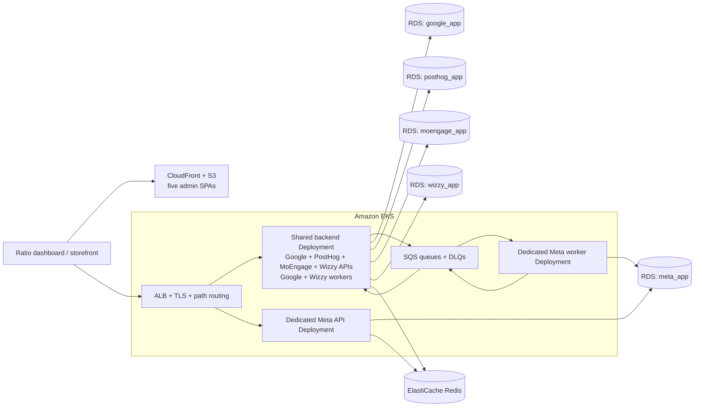

# Ratio Apps architecture

Ratio Apps is one NestJS codebase containing multiple isolated marketplace app modules. Each module owns its URL prefix, credentials, database, admin SPA, and vendor integration. Shared infrastructure lives in `apps/backend/src/core/`.

The root Dockerfile produces one backend-only image. Production reuses that image
across three backend workloads: a shared non-Meta API with its lightweight
Google/Wizzy workers, a dedicated Meta API, and an independently scaled Meta
worker. Admin SPAs are separate static artifacts.

## Live modules

| Module | Prefix | Database | Admin | Worker |
|---|---|---|---|---|
| Google | `/google/*` | `google_app` | `apps/admin-google` | `google-product-sync` SQS |
| Meta | `/meta/*` | `meta_app` | `apps/admin-meta` | `meta-capi` SQS |
| PostHog | `/posthog/*` | `posthog_app` | `apps/admin-posthog` | None |
| MoEngage | `/moengage/*` | `moengage_app` | `apps/admin-moengage` | None |
| Wizzy | `/wizzy/*` | `wizzy_app` | `apps/admin-wizzy` | `wizzy-product-sync` SQS |

The canonical app registry is
`apps/backend/src/config/apps.ts`. `_template` modules and packages are
scaffolder copy-sources and are not mounted or built as live apps.

## Production topology



This diagram is the application contract, not an assertion that Kubernetes,
Helm, or Terraform manifests exist in this repository.

## One image, multiple process roles

The same immutable backend image is used for every backend workload.

### Shared backend process

```text
node apps/backend/dist/apps/backend/src/main.js
ENABLED_MODULES=google,posthog,moengage,wizzy
GOOGLE_SYNC_WORKER_ENABLED=true
WIZZY_SYNC_WORKER_ENABLED=true
META_WORKER_ENABLED=false
```

`ENABLED_MODULES` controls which NestJS modules are mounted and which app
credential/database blocks are required at startup. It defaults to `all` for
local development; unknown slugs fail fast.

The shared backend serves the four lighter APIs and starts the Google and Wizzy
SQS consumers through their module-init flags. Every replica therefore opens one
database pool for each of those four modules and becomes an additional consumer
for both queues. This intentionally keeps the workload count small, but HTTP
autoscaling must respect Google/Wizzy vendor quotas and queue concurrency.

### Dedicated Meta API process

```text
node apps/backend/dist/apps/backend/src/main.js
ENABLED_MODULES=meta
META_WORKER_ENABLED=false
GOOGLE_SYNC_WORKER_ENABLED=false
WIZZY_SYNC_WORKER_ENABLED=false
```

Meta receives an independent API Deployment because its catalog and CAPI paths
are the heaviest backend workload. Meta API scaling, failures, secrets, database
pool, and readiness remain isolated from the shared backend.

### Dedicated Meta worker process

```text
node apps/backend/dist/apps/backend/src/main.worker.js
ENABLED_MODULES=meta
META_WORKER_ENABLED=true
GOOGLE_SYNC_WORKER_ENABLED=false
WIZZY_SYNC_WORKER_ENABLED=false
```

`main.worker.js` creates the Meta application context without opening an HTTP
listener. The worker can scale from SQS backlog independently of Meta HTTP
traffic. It stops receiving new work on shutdown; unacknowledged messages become
visible again through SQS.

| Module | Placement | Worker flag | Queue behavior |
|---|---|---|---|
| Google | Shared backend API pods | `GOOGLE_SYNC_WORKER_ENABLED=true` | Product create/update/delete operations are sent to GMC |
| Meta | Dedicated worker pods | `META_WORKER_ENABLED=true` | Browser CAPI events are buffered per merchant and sent to Meta |
| Wizzy | Shared backend API pods | `WIZZY_SYNC_WORKER_ENABLED=true` | Product create/update/delete operations are sent to Wizzy |

PostHog and MoEngage have browser-side vendor SDK delivery and therefore no
backend queue consumer.

## Placement contract for new apps

Every new app records two approved fields in
`docs/agent/apps/<slug>/STATE.json`:

```json
{
  "deployment": {
    "apiPlacement": "shared",
    "workerPlacement": "none"
  }
}
```

- `apiPlacement`: `shared` for the common backend or `dedicated` for an isolated
  API Deployment.
- `workerPlacement`: `shared-api` when the consumer runs in the shared backend
  pods, `dedicated-worker` when it needs independent scaling, or `none`.

The PRD workflow must ask for this decision. Backend-heavy, high-volume,
latency-sensitive, or failure-isolation-sensitive apps should default to
`dedicated`; otherwise `shared` is preferred. The deployer uses the recorded
choice to update the approved external EKS pipeline/GitOps configuration.

## Module and shared-core boundary

`apps/backend/src/core/` is a library of cross-app infrastructure:

- AES-256-GCM credential encryption;
- Ratio OAuth/introspection client;
- module-scoped Kysely client factory;
- generic merchant, OAuth, and webhook services;
- shared SQS wrapper and health registry;
- validation pipes, exception filters, decorators, and request logging;
- `createAppProviders`, which binds generic services to one module's tokens,
  credentials, and database.

App modules do not subclass or copy core services. Each module wires them with
module-owned DI symbols, then adds only its vendor-specific configuration,
controllers, SDK, bootstrap logic, webhooks, workers, and database schema.
Providers are not global, preventing accidental cross-module access.

## Per-app database isolation

Every app uses `RATIO_<APP>_DATABASE_URL` and its own MySQL database:

```text
merchants
oauth_tokens
webhook_log
<slug>_configs
<app-specific operational tables>
```

The same merchant ID can exist independently in multiple app databases. There
is no shared app discriminator column and no supported cross-app query path.

Kysely migrations are per app and run through
`apps/backend/scripts/migrate.ts <slug>`. Production migration execution is a
CI/CD or one-shot job concern; the minimal runtime image does not contain the
TypeScript migration source/tooling.

## Request and lifecycle flows

### Install

1. Ratio redirects to `/<slug>/api/v1/oauth/callback`.
2. The module exchanges the code using its `RATIO_<APP>_CLIENT_*` credentials.
3. One transaction upserts the merchant and encrypted tokens.
4. The app bootstrap seeds `<slug>_configs`.
5. The admin receives the merchant session through an HttpOnly cookie.

### Webhook

1. Ratio posts to `/<slug>/api/v1/oauth/webhook`.
2. The module verifies `X-OpenStore-Signature` in production.
3. `webhook_log` provides idempotency.
4. Module handlers update local state or enqueue durable work.

### Queue processing

API handlers enqueue and return quickly. Google/Wizzy consumers run inside the
shared API process; the Meta consumer runs in a dedicated worker process. Every
consumer acknowledges an SQS message only after the vendor operation succeeds.
Failures remain unacknowledged for redelivery; AWS redrive policies move
repeatedly failing messages to the module DLQ.

## Admin and storefront delivery

Each `apps/admin-<slug>` package is built independently. Production publishes
its `dist/` directory to a dedicated static origin such as S3/CloudFront and
sets `RATIO_<APP>_ADMIN_BASE_URL` to that public URL.

Wizzy additionally ships `packages/wizzy-sdk`, an opt-in Lit storefront SDK.
The backend image contains its built loader/widget/results bundles because the
Wizzy API serves them under `/wizzy/sdk/*`. Private Wizzy store secrets must
never be returned to the browser.

## Health and scaling boundaries

- API liveness: `GET /healthz`.
- API readiness: `GET /ready`, which checks the databases mounted in that process.
- Dedicated Meta worker: no HTTP listener; use process state, logs, queue
  depth/age, DLQ depth, and successful-processing metrics.
- Embedded Google/Wizzy consumers: use shared pod health plus queue and
  successful-processing metrics.
- Database pool budget:
  each shared replica opens four module pools; each Meta API/worker replica opens
  one Meta pool. Keep each database/cluster below approximately 60% of
  `max_connections`.
- Shared API HPA should use CPU plus ALB/request latency or request-rate metrics,
  while checking that the resulting Google/Wizzy consumer count stays inside
  vendor quotas. Meta API HPA uses HTTP signals; Meta worker autoscaling uses SQS
  backlog and oldest-message age.

The architecture can be scaled toward a 50,000-RPS target, but capacity is not
certified by this document. Prove it with staged load tests using representative
routes, payloads, cache ratios, database sizes, queue traffic, and vendor limits.

## Local versus production

`docker-compose.yml` is a local stack containing MySQL, Redis, ElasticMQ, and a
backend with all modules mounted. Production uses managed AWS services and
the three EKS workloads defined above. The repository intentionally has no
production Docker Compose topology.

## Why this shape

Per-app databases preserve data ownership. A shared core and immutable image
prevent vendor forks and release drift. The lighter apps share operational
capacity, while Meta retains independent API and worker scaling because its
catalog/CAPI processing dominates backend load.
